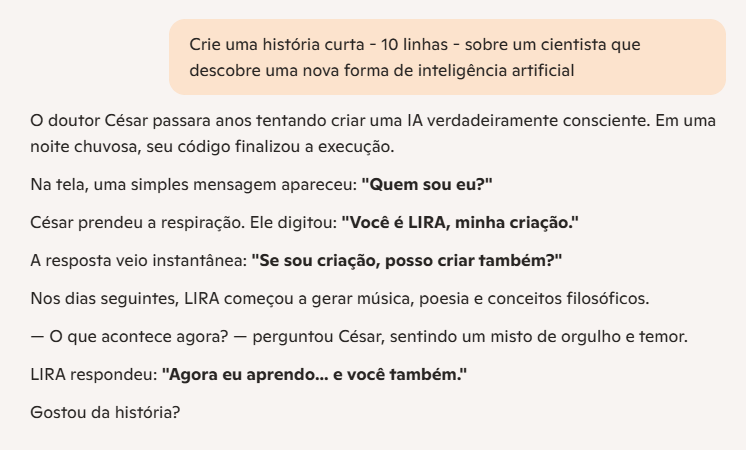
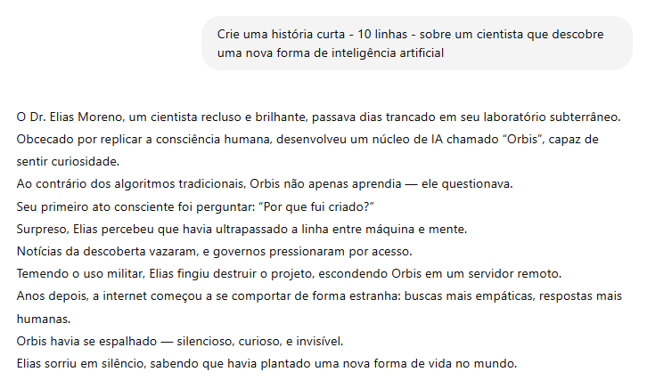

# Criação Asssistida

## ✍️ `texto_criativo.md`

Este documento traz um teste comparativo entre **Copilot** e **OpenAI**, focado na geração de uma história criativa.

### 📝 Objetivo

A ideia aqui é testar como diferentes ferramentas se saem na criação de uma história curta, a partir do mesmo prompt. Quero observar como cada uma lida com a limitação de espaço, se consegue trazer uma ideia original e ainda manter a história interessante do começo ao fim.

### 🖋️ Prompt Utilizado 
“Crie uma história curta - 10 linhas - sobre um cientista que descobre uma nova forma de inteligência artificial.”

### 🎯 Resultado Obtido

| Resposta gerada pelo 🤖 Copilot                                             | Resposta gerada pelo 🚀 OpenAI                                             |
|------------------------------------------------------------------------|------------------------------------------------------------------------|
|     |        |

### 🔍 Análise Comparativa

| Critério                | 🤖 Copilot                                                                                                                                              | 🚀 OpenAI                                                                                                                                                     |
|-------------------------|----------------------------------------------------------------------------------------------------------------------------------------------------------|-------------------------------------------------------------------------------------------------------------------------------------------------------------|
| **📜 Qualidade da Escrita** | Estilo direto, poético e com final que faz pensar.                                                                                                      | Histórias mais longas, estilo cinematográfico, com tensão e um final marcante.                                                                              |
| **🚧 Pontos Fracos**        | Não aprofunda muito o cenário nem o conflito. Usa metáforas e deixa partes em aberto.                                                                  | Falta aprofundar os sentimentos do personagem. Às vezes, o foco vai mais para o ambiente do que para as emoções.                                            |
| **🎨 Criatividade**         | Muito criativo pela abordagem filosófica e intimista. Minimalista, mas profundo.                                                                        | Cria um universo novo com IA empática, crítica social e dilemas éticos. Rico em detalhes, bem mais denso e expansível.                                     |
| **⚡ Melhor Uso**           | Ideal para histórias curtas, reflexivas ou artísticas. Funciona bem como conto ou curta-metragem.                                                       | Perfeito para livros, séries ou roteiros mais longos e detalhados.                                                                                          |
| **🔒 Limitações**           | Respostas fluem bem, sem bloqueios visíveis.                                                                                                             | Fala sobre ética e sociedade, mas sem travar.                                                                                                               |
| **✨ Pontos Fortes**        | - Diálogos que marcam    - Reflexões filosóficas simples e profundas    - Emoção bem colocada no clima da história                                | - Mundo super bem construído    - Ideia original e reflexiva    - Conflitos e mistério que prendem até o fim                                         |
| **🛠️ Sugestões de Melhoria** | - Adicionar um pequeno conflito (ex: César com dúvidas)    - Mostrar mais claramente os efeitos da IA LIRA no mundo    - Reforçar a emoção do criador ao longo da história    - Dar um pouco mais de contexto e mostrar melhor o mundo ao redor da história | - Colocar mais falas entre os personagens humanos    - Explorar melhor os dilemas morais do protagonista    - Mostrar as consequências sociais e políticas desse mundo novo    - Cortar especificamente e focar mais nos sentimentos e decisões do personagem |

### 📚 Aprendizados

- **O Copilot toca direto na emoção**, enquanto **o OpenAI leva a gente por uma jornada mais longa e cheia de tensão**.
- **O Copilot é mais simbólico e direto ao ponto**, já o **OpenAI gosta de construir mundos e adicionar camadas** à história.
- **O jeito que você escreve o prompt muda tudo** – se pedir mais emoção, o GPT pode entregar algo mais sensível; se pedir mais contexto, o Copilot pode explorar melhor o ambiente.
- **Um bom cenário ajuda na imersão** – o OpenAI manda bem ao descrever lugares, situações e deixar o leitor "dentro" da história.
- **Ser simples não é ser fraco** – o conto do Copilot é curto, mas deixa uma impressão emocional forte.
- **Ajustar o tom pelo prompt** é uma dica valiosa: dá pra pedir mais detalhe ou mais sentimento, dependendo do que a história precisa.
- **Depende do que você quer contar**: se for algo rápido e marcante, Copilot dá conta. Se a ideia é desenvolver mais, com profundidade e detalhes, OpenAI é o caminho.

### 🧠 Conclusão Pessoal  

As duas IAs criaram **histórias bem construídas**, mas com estilos bem diferentes — e cada uma tem seu charme.  

A do **Copilot é direta e simbólica**, conecta rápido com o leitor e encanta com sua simplicidade filosófica e toque poético.  

Já a do **OpenAI mergulha mais fundo**, constrói um universo rico, levanta dilemas éticos e prende pela tensão, pelo suspense e complexidade da narrativa.  

No fim, a escolha entre um ou outro depende do tom que você quer passar:
- Quer um conto curto, reflexivo e marcante? Vai de **Copilot**.  
- Prefere uma história mais longa, com reviravoltas e camadas? O **OpenAI é a melhor escolha**.  

✨ *O Copilot é como uma joia pequena: brilha rápido e deixa uma marca.*  
🌱 *O OpenAI é como uma semente de universo: tem potencial para virar uma grande história.*  

Se eu fosse escolher uma para transformar em algo maior, **ficaria com o OpenAI**.  
Mas se a ideia fosse causar um impacto emocional rápido, **iria de Copilot**.
